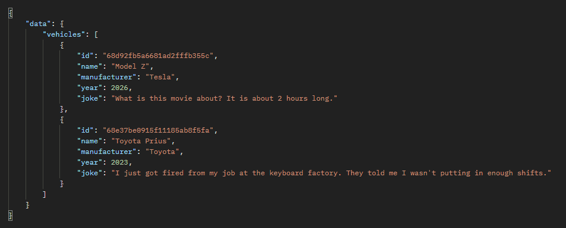
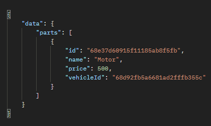
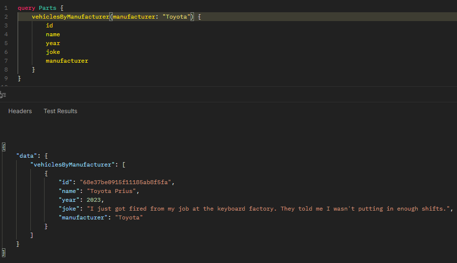
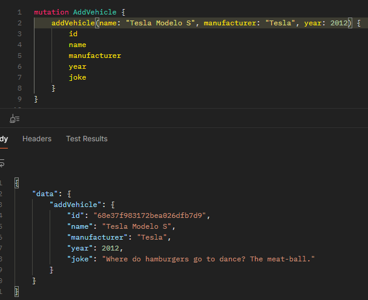

# graphqlLab 🚀

   

Un servidor GraphQL backend en Deno/TypeScript para gestionar vehículos y partes de autos, con mutations asíncronas, integración de APIs externas (e.g., fetch de chistes aleatorios) y conexión a MongoDB Atlas. Ideal para aprender resolvers, contextos y escalabilidad en entornos modernos.

## ✨ Características
- **GraphQL Schema Completo**: Queries (listar vehículos/partes), Mutations (añadir vehículo con joke API).
- **Backend Async**: Usa `Promise.all` para paralelizar inserts DB + fetch externo.
- **DB Integrada**: MongoDB para collections "vehiculos" y "parts" (con validación y error handling).
- **Seguro y Moderno**: Variables de entorno para creds, try-catch en resolvers, Deno para ejecución segura.
- **Extensible**: Fácil añadir IA (e.g., recomendaciones de partes con cosine similarity de mi proyecto ML).

## 🛠️ Tech Stack
- **Framework**: Apollo Server v4 (GraphQL)
- **Runtime**: Deno (seguro, sin node_modules)
- **DB**: MongoDB Atlas (NoSQL)
- **Lenguaje**: TypeScript (tipado fuerte)
- **Otras**: Fetch API (nativo), Zod para validación (opcional)

## 📋 Requisitos
- Deno 1.40+ (`deno --version`)
- MongoDB Atlas (cuenta gratuita) o local
- Editor: VS Code con Deno extension

## 🚀 Setup Rápido
1. **Clona el Repo**:
 ```bash
   git clone https://github.com/carmenkilbourne/graphqlLab.git
   cd graphqlLab
   ```

2. **Configura .env** (no commitees—añade a .gitignore):

3. **Instala Dependencias** (Deno maneja imports dinámicos—no npm):

      "@apollo/server": "https://deno.land/x/apollo_server@4.10.5/mod.ts"
      
## Resultados de algunas de las querys
### Mostrar todos los vehiculos


### Mostrar todas las partes 


### Mostrar vehiculos filtrados por manufacter


### Agregar vehiculo a mi lista de vehiculos

